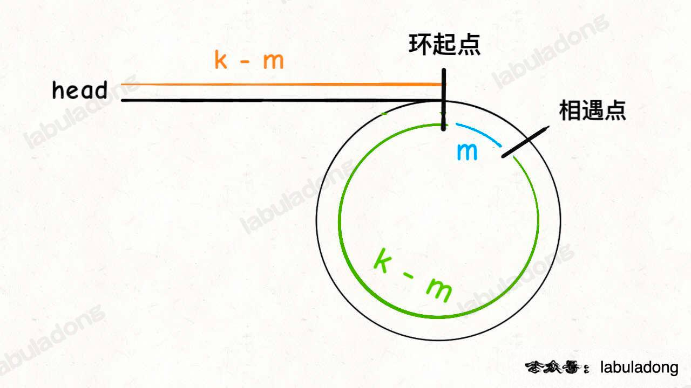

# 双指针

快慢指针技术，fast pointer steps 2，slow pointer steps 1

数组也是链表

#### 142. Linked List Cycle ll <a href="#id-142linkedlistcyclell" id="id-142linkedlistcyclell"></a>

fast step2, slow steps 1,会在环中相遇

如果一个从头head出发，一个从相遇点出发都steps=1，会在环起点相遇

因为如图都是k-m

<figure><figcaption></figcaption></figure>

[力扣](https://leetcode.cn/problems/linked-list-cycle-ii/)

```go
/**
 * Definition for singly-linked list.
 * type ListNode struct {
 *     Val int
 *     Next *ListNode
 * }
 */
// if fast pointers step out of lists, there is no cycle.
// fast-pointer and slow-pointer meet.
func detectCycle(head *ListNode) *ListNode {
    slow, fast := head, head
    for fast != nil && fast.Next != nil {
        fast = fast.Next.Next
        slow = slow.Next
        if slow == fast {
            break
        }
    }
    // 没有环，直接退出了上一个循环
    if fast == nil || fast.Next == nil {
        return nil
    }

    slow = head 
    for slow != fast {
        slow = slow.Next
        fast = fast.Next
    }
    return slow
}
```

#### 287.Find the Duplicate Number 🟡 <a href="#id-287findtheduplicatenumber" id="id-287findtheduplicatenumber"></a>

[力扣（LeetCode）官网 - 全球极客挚爱的技术成长平台](https://leetcode.cn/problems/find-the-duplicate-number)

**题目要求**

1. n + 1个数字，范围\[1,n],所以必定至少有一个重复的数字
2. 题目限定只有 **一个重复的整数**
3. n≥1，所以nums长度`n+1`最小为2

```go
// [1, n] 共 n+1个数，至少存在一个重复的数字
// 题目给定只存在一个重复的数字
func findDuplicate(nums []int) int {
    // 必定存在且只存在一个环
    // len(nums) = n + 1; n最小为1, 长度最小为2
    slow, fast := 0, 0

    // 在环中相遇
    for true {
        slow = nums[slow]
        fast = nums[nums[fast]]
        if slow == fast {break}
    }

    p1, p2 := 0, slow
    for p1 != p2 {
        p1 = nums[p1]
        p2 = nums[p2]
    }
    return p1
}
```

#### 160.Intersection of Two Linked Lists <a href="#id-160intersectionoftwolinkedlists" id="id-160intersectionoftwolinkedlists"></a>

[力扣](https://leetcode.cn/problems/intersection-of-two-linked-lists/)

将两个链表链接在一起， 一个 list1 + list2 一个 list2 + list1

<figure><figcaption></figcaption></figure>

```go
/**
 * Definition for singly-linked list.
 * type ListNode struct {
 *     Val int
 *     Next *ListNode
 * }
 */
 //将两个链表链接在一起，
 // 一个 list1 + list2
 // 一个 list2 + list1
func getIntersectionNode(headA, headB *ListNode) *ListNode {
    p1, p2 := headA, headB
    for p1 != p2 {
        if p1 == nil {
            p1 = headB
        }else {
            p1 = p1.Next
        }
        if p2 == nil {
            p2 = headA
        }else {
            p2 = p2.Next
        }
    }
    // if there is no intersection, p1 equals nil
    return p1
}
```

#### 19. Remove Nth Node From End of List <a href="#id-19removenthnodefromendoflist" id="id-19removenthnodefromendoflist"></a>

要寻找倒数k个节点，用双指针

4. 从虚拟头节点0开始走，p1指针先走k步，到达第k个节点
5. 然后p2指针从虚拟节点0开始，和p1一起同步前进，直到p1走到末尾n+1节点为空，共走了n+1-k步p2就达到第n+1-k个了，即倒数第k个

因为 倒数第1个是 正数第n个，即(n+1) - 1个 倒数第2个是正数第n-1个，即(n+1) - 2个 倒数第3个是正数第n-2个，即(n+1) - 3个 。。。。 倒数第k个是正数第n-k+1个，即(n+1) - k个

[力扣](https://leetcode.cn/problems/remove-nth-node-from-end-of-list/)

```go
/**
 * Definition for singly-linked list.
 * type ListNode struct {
 *     Val int
 *     Next *ListNode
 * }
 */
func removeNthFromEnd(head *ListNode, n int) *ListNode {
    dummy := &ListNode{-1, head}
    // 找到倒数n+1个节点，即n个节点前面的一个
    x := findFromEnd(dummy, n + 1)
    x.Next = x.Next.Next
    return dummy.Next
}

func findFromEnd(head *ListNode, k int) *ListNode {
    p1, p2 := head, head
    // 从虚拟头节点0开始移动
    // p1走k步，移动到k个节点
    for i := 0; i < k; i++ {
        p1 = p1.Next
    }

    // p1走了N-k+1步，到达第n+1个节点
    // p2走了N-k+1步，到达了n-k + 1 个节点。
    for p1 != nil {
        p1 = p1.Next
        p2 = p2.Next
    }
    //p2位于n-k+1个节点，即倒数第k个
    //为倒数第1个为正数第n个节点：n = (n+1) - 1
    //倒数第k个节点： 为正数(n+1) - k
    return p2
}
```

#### 判断是否为回文字符串 <a href="#undefined" id="undefined"></a>

双指针

```cpp
// 双指针法
bool isPalindrome(const string& s, int start, int end) {
    for (int i = start, j = end; i < j; ++i, --j) {
        if (s[i] != s[j]) return false;
    }
    return true;
}
```

动态规划

判断\[i, n]是否为回文， 需要2个条件

6. \[i+1, n-1]是否为回文？
7. if (s\[i] == s\[n]) ?

所以构造 \[i]\[j]二维判断查找表isPalindrome

\[i,j]结果依靠\[i+1, j-1], 所以i倒序，j正序

```cpp
vector<vector<bool>> isPalindrome;
void computePalindrome(const string& s) {
  // isPalindrome[i][j] 代表 s[i:j](双边包括)是否是回文字串
  isPalindrome.resize(
      s.size(),
      vector<bool>(s.size(), false));  // 根据字符串s, 刷新布尔矩阵的大小
  for (int i = s.size() - 1; i >= 0; i--) {
    // 需要倒序计算, 保证在i行时, i+1行已经计算好了
    for (int j = i; j < s.size(); j++) {
      // 一些细节处理
      if (j == i) {  // 1个字符的情况
        isPalindrome[i][j] = true;
      } else if (j - i == 1) {  // 2个字符的情况
        isPalindrome[i][j] = (s[i] == s[j]);
      } else {
        isPalindrome[i][j] = (s[i] == s[j] && isPalindrome[i + 1][j - 1]);
      }
    }
  }
}
```

#### 5. Longest Palindrome Substring <a href="#id-5longestpalindromesubstring" id="id-5longestpalindromesubstring"></a>

[力扣（LeetCode）官网 - 全球极客挚爱的技术成长平台](https://leetcode.cn/problems/longest-palindromic-substring/description/)

8. 中心向两侧扩散判断是否为回文串
9. 遍历，依次选取字符为中心
10. 可能是偶数回文，也可能是奇数回文，分别判断

```go
func longestPalindrome(s string) string {
    res := ""
    for i := 0; i < len(s); i++ {
        odd := subPalindrome(s, i, i)
        even := subPalindrome(s, i, i+1)
        if len(odd) > len(res) {
            res = odd
        }
        if len(even) > len(res) {
            res = even
        }
    }
    return res
}

func subPalindrome(s string, left, right int) string {
    for left >= 0 && right < len(s) && s[left] == s[right] {
        left--
        right++
    }
    return s[left+1 : right]
}
```

***

### 原地修改数组 <a href="#id-1" id="id-1"></a>

#### 26.Remove Duplicates from Sorted Array <a href="#id-26removeduplicatesfromsortedarray" id="id-26removeduplicatesfromsortedarray"></a>

[力扣（LeetCode）官网 - 全球极客挚爱的技术成长平台](https://leetcode.cn/problems/remove-duplicates-from-sorted-array/description/)

<figure><figcaption></figcaption></figure>

```go
func removeDuplicates(nums []int) int {
    if len(nums) == 0 {
        return 0
    }
    slow, fast := 0, 0
    for ; fast < len(nums); fast++ {
        if nums[fast] != nums[slow] {
            slow++ // 先移动
            nums[slow] = nums[fast]
        }
    }
    // slow是索引，返回个数
    return slow + 1
}
```

#### 283. Move Zeros <a href="#id-283movezeros" id="id-283movezeros"></a>

[力扣](https://leetcode.cn/problems/move-zeroes/)

11. 快慢指针移除==0的元素
12. 剩余位置赋值为0

```go
func moveZeroes(nums []int) {
    n := len(nums)
    slow, fast := 0, 0
    for ; fast < n; fast++ {
        if nums[fast] != 0 {
            nums[slow] = nums[fast]
            slow++
        }
    }
    for fast--; fast >= slow; fast-- {
        nums[fast] = 0
    }
}
```

调用移除元素的函数

```go
func moveZeroes(nums []int) {
    p := removeElements(nums, 0)
    for ; p < len(nums); p++ {
        nums[p] = 0
    }
}
func removeElements(nums []int, val int) int {
    n := len(nums)
    slow := 0
    for fast := 0; fast < n; fast++ {
        if nums[fast] != 0 {
            nums[slow] = nums[fast]
            slow++
        }
    }
    return slow
}
```

***

#### 167. Two Sum II - Input Array Is sorted <a href="#id-167twosumiiinputarrayissorted" id="id-167twosumiiinputarrayissorted"></a>

[力扣](https://leetcode.cn/problems/two-sum-ii-input-array-is-sorted/)

因为已经排好序了，二分查找类似

两个指针一左一右

```go
func twoSum(numbers []int, target int) []int {
    left, right := 0, len(numbers)-1
    // 两个数字，索引不能相同
    for left < right {
        sum := numbers[left] + numbers[right]
        if sum == target {
            return []int{left + 1, right + 1}
        } else if sum < target {
            left++
        } else if sum > target {
            right--
        }
    }
    return []int{-1, -1}
}
```
